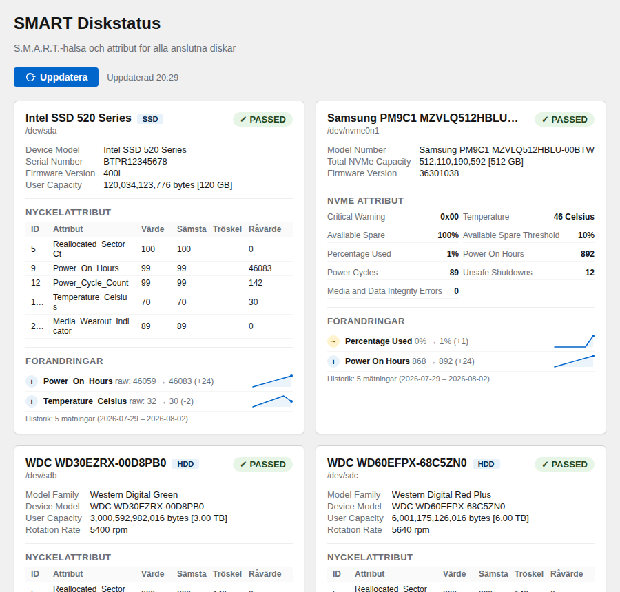

# cockpit-smart — SMART Diskstatus for Cockpit

Cockpit plugin that displays S.M.A.R.T. health and attributes for all connected disks, with history tracking and trend detection.

> This is a personal hobby project I build for my own use and publish in case it's useful to someone else. I work on it in my spare time, so issues and PRs are welcome but replies may be slow. Use at your own risk.



## Features

- Health status (PASSED/FAILED) per disk
- Automatic disk type identification (HDD/SSD/NVMe)
- Key attributes highlighted (reallocated sectors, pending sectors, etc.)
- NVMe-specific attributes (available spare, percentage used, media errors)
- Warning markers for critical values
- Expandable details for all SMART attributes
- Manual refresh button

### History and Trend Detection

- **Daily logging**: `smart-history.sh` collects SMART data and appends it as JSONL to `/var/log/smart-history.json`
- **Change detection**: Automatically flags attributes that changed since the previous measurement
  - SATA: raw value changes, value drops, threshold proximity (< 2x threshold)
  - NVMe: numeric changes in all attributes
  - Generalized logic — works for any disk type without hardcoded attribute lists
- **Sparklines**: Inline SVG mini-graphs showing trends over the last 30 data points
- **Severity levels**: Danger (red), warning (yellow), info (blue) — sorted by severity
- **Log rotation**: 365 days retention with compression

## Installation

```bash
sudo bash install.sh
```

This will:
- Install `smartmontools` if not present
- Copy plugin files to `/usr/share/cockpit/cockpit-smart/`
- Set up a daily cron job (08:00) for history collection
- Configure logrotate (365 days retention)

Requirements: `smartmontools`, `python3`, `cockpit`

## Access

Open Cockpit in your browser and click **SMART Status** in the menu.

URL: `https://<your-server>:9090/cockpit-smart/`

## File Structure

```
cockpit-smart/
├── manifest.json              # Cockpit plugin manifest
├── index.html                 # UI (HTML + CSS + JS)
├── scripts/
│   ├── smart-collect.sh       # Data collection (smartctl → JSON)
│   └── smart-history.sh       # History logging (JSONL with timestamp)
├── install.sh                 # Installation script (plugin + cron + logrotate)
└── README.md
```

## How It Works

1. `index.html` uses `cockpit.spawn()` to run `smart-collect.sh` with superuser privileges
2. `smart-collect.sh` runs `smartctl` against all disks and collects info/health/attributes
3. Output is parsed as JSON and rendered as cards per disk in the web UI
4. History is loaded from `/var/log/smart-history.json` and compared to current data
5. Changes are displayed in a "Forandringar" (Changes) section per disk card with sparklines

### History Format (JSONL)

Each line in `/var/log/smart-history.json` is a complete JSON object:

```json
{"timestamp":"2025-03-15T08:00:00Z","disks":[...]}
```

The `disks` array has the same structure as `smart-collect.sh` output.

## Testing Without Cockpit

Open `index.html` directly in a browser — it falls back to mock data with simulated history for testing the trend detection and sparkline features.

## Cron Schedule

The history collection runs daily at 08:00 via `/etc/cron.d/smart-history`. Adjust the schedule by editing that file if your server has different wake/sleep times.

## License

MIT

## Part of a Cockpit plugin suite

I build a small family of Cockpit plugins for home servers, all
dependency-light and made to be readable at a glance:

- [cockpit-temps](https://github.com/cgillinger/cockpit_temp) — hardware temperature history with thresholds
- **cockpit-smart** — S.M.A.R.T. disk health with trend tracking *(this plugin)*
- [cockpit-pcloud](https://github.com/cgillinger/cockpit-pcloud) — pCloud storage quota and backup folder status
- [cockpit-tailscale](https://github.com/cgillinger/cockpit_tailscale) — plain-language Tailscale network overview

Browse them all via the [cockpit-plugin topic](https://github.com/search?q=user%3Acgillinger+topic%3Acockpit-plugin&type=repositories).
